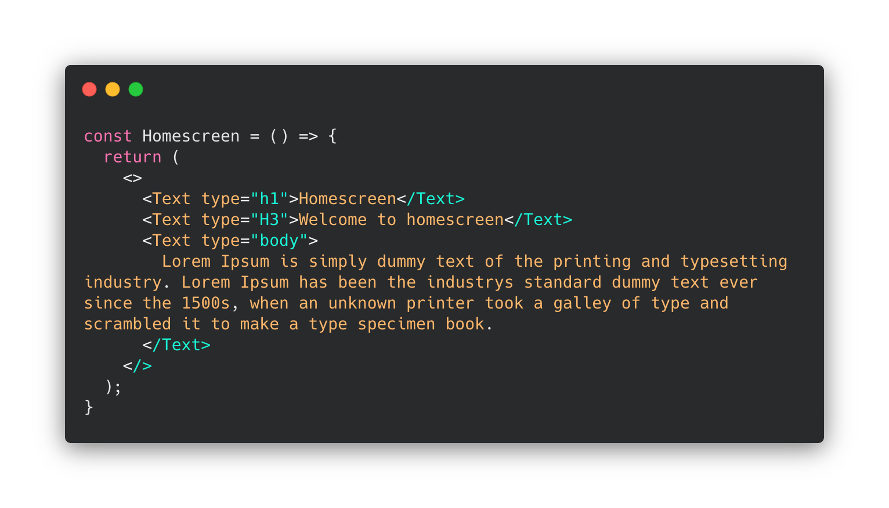

# Render components without ifs
With this method, avoid using so many ifs in your code

 

### Nothing fancy
Using object literals we can avoid ifs like so:

and using the component:

See [this example](example_1.js) and [this example](example_2.js)

